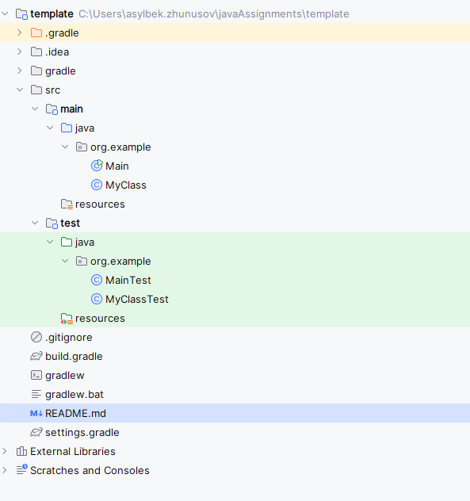
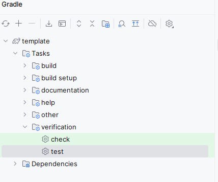
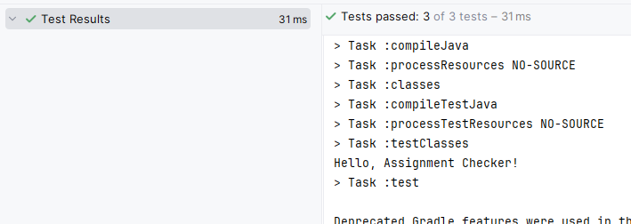
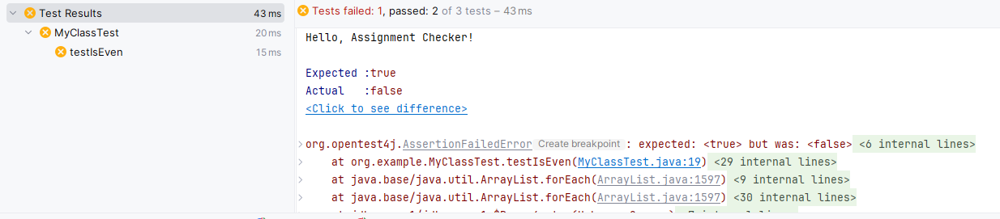
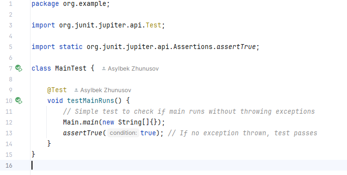
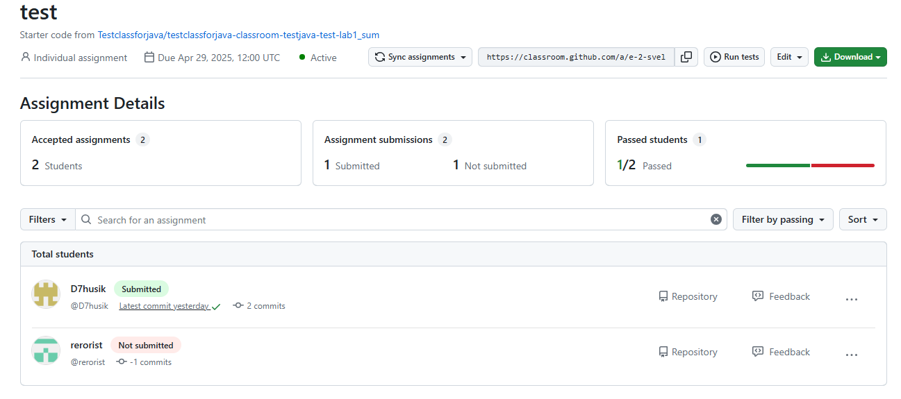

# Final Report: Java Assignment Checker Using GitHub Classroom

  
*High-level overview of the assignment checking process*

## 1. Java Concepts and Tools Used

### Gradle as Build System
We used **Gradle** to manage project builds instead of manually compiling Java files. Below is the standard project structure and available tasks:

  
*Standard Gradle project layout with `src/main/java` for code and `src/test/java` for tests*

  
*Available Gradle tasks including build, test, and verification tasks*

**Advantages of Gradle:**
- 🚀 Faster and more efficient builds (supports incremental builds)
- 📦 Easy dependency management (especially for libraries like JUnit 5.8)
- 🛠 Simplified build scripts that are easy to customize
- 🖥 Works seamlessly with IDEs like IntelliJ IDEA
- 🧩 Supports plugins for additional features like code coverage and reporting

### JUnit 5.8 for Testing
Each assignment included **JUnit 5.8** test cases to automatically verify correctness:

  
*Example of all tests passing (3/3) with execution time*

  
*Detailed test failure showing expected vs actual results*

**Advantages of JUnit 5.8:**
- 🔥 More powerful and flexible compared to older versions
- 🔄 Better support for parameterized and dynamic tests
- ✅ Clearer assertion methods for better readability
- ⚡ Faster test execution and better integration with IntelliJ IDEA and Gradle

### Writing Test Cases in IntelliJ IDEA
We encouraged students to write and run tests in **IntelliJ IDEA**:

  
*IntelliJ's built-in test runner with visual results*

Key features:
- 🖥 Easy project setup with Gradle integration
- 📊 Built-in test runners showing visual pass/fail results
- ✨ Code completion, syntax checking, and quick fixes
- 🐞 Easy debugging of failed test cases
- 🎯 Ability to create complex test cases involving multiple classes, exception scenarios, and edge cases

---

## 2. GitHub Classroom Usage and Advantages

  
*GitHub Classroom assignment management view*

**Key Advantages:**
- 🛠 Automatic private repository creation for each student
- 📑 Easy submission tracking with commit history and timestamps
- 📂 Centralized management of all submissions in one place
- 🌎 Real-world version control practice: branching, committing, and pushing
- 💬 Feedback integration via GitHub Issues or Pull Requests
- 🔒 Secure, private repositories to minimize code sharing between students
- ⚙️ Extensibility with GitHub APIs for automated grading and mass operations

---

## 3. How To Use the System

### For Instructors:

1. **Create Template Repository**
    - Create a new GitHub repository containing:
        - Assignment description (`README.md`)
        - Starter Java code organized in a Gradle project structure (`src/main/java`, `src/test/java`)
        - A `build.gradle` configured to use JUnit 5.8.

2. **Set Up Assignment in GitHub Classroom**
    - Open [GitHub Classroom](https://classroom.github.com/).
    - Create a new assignment:
        - Link to the prepared template repository.
        - Set repositories to be **private**.
        - Choose "individual" or "group" assignment type.

3. **Distribute Invitation Link**
    - Generate the invitation link.
    - Share it with students (via email, LMS, or group chat).

4. **Collect and Grade Submissions**
    - Clone all student repositories at once:
      ```bash
      git clone https://github.com/classroom/<student-repo>.git
      ```
    - Run Gradle commands:
      ```bash
      ./gradlew build
      ./gradlew test
      ```
    - Check the generated reports (`build/reports/tests/test/index.html`).

5. **Provide Feedback**
    - Open issues or pull requests directly on student repositories to give feedback.

---

### For Students:

1. **Accept the Assignment**
    - Click the invitation link provided by the instructor.
    - A personal private repository will be created automatically.

2. **Clone Your Repository**
   ```bash
   git clone https://github.com/classroom/<your-assignment-repo>.git
3. **Open the Project in IntelliJ IDEA**
   - Open IntelliJ IDEA.
   - Click `Open` and select your cloned repository.
   - When prompted, `import the Gradle project` (usually IntelliJ detects it automatically).
   - Wait for Gradle to finish downloading dependencies.
4. **Implement Your Solution**
   - Write your Java code inside (`src/main/java/org/example/`).
   - You can create new classes or modify existing ones as needed.
5. **Write and Run Own Unit Tests**
   - Add test cases inside (`src/test/java/org/example/`).
   - Use JUnit 5 annotations like `@Test` and assertions like `assertEquals`, `assertTrue`.
   - Run tests by:
     - Right-clicking the test file → `Run 'TestClassName'`
     - Or using the Gradle panel: `Tasks > verification > test`
6. **Check Test Results**
   - Make sure all tests pass locally.
   - If any test fails, read the error message carefully, fix your code, and rerun.
7. **Commit and Push Your Work**
   ```bash
   git add .
   git commit -m "Completed assignment with all tests passing"
   git push origin main
8. **Verify on GitHub**
   - Go to your GitHub repository.
   - Confirm that all your files and recent commits have been uploaded.
